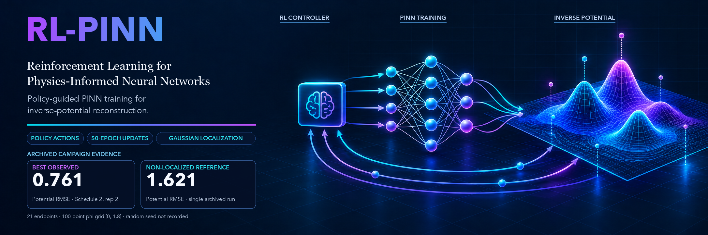

# RL-PINN

RL-PINN trains a reinforcement-learning controller to tune a physics-informed neural network for the inverse-potential task in this repository. The experiment code, input data, schedule registry, and compact reported-result summary are kept together here.



## Reproduce

Use Python 3.11 and install the pinned dependencies:

```bash
python3.11 -m venv .venv
.venv/bin/python -m pip install -r requirements.txt
```

Run the strategy smoke checks and inspect the available schedules:

```bash
PYTHON_BIN=.venv/bin/python ./reproduce.sh --smoke-test
PYTHON_BIN=.venv/bin/python ./reproduce.sh --list-schedules
```

Run the full reported campaign, one schedule, or the non-localized reference:

```bash
PYTHON_BIN=.venv/bin/python ./reproduce.sh --all
PYTHON_BIN=.venv/bin/python ./reproduce.sh --schedule schedule_5
PYTHON_BIN=.venv/bin/python ./reproduce.sh --reference
```

`--all` runs the non-localized reference and all schedule replicates in `configs/schedules.json`. Add `--include-extensions` to also render the 200K and 500K inference extensions for Schedule 1 replicate 1 and Schedule 2 replicate 2. Use `--replicate N`, `--workers N`, `--output-dir PATH`, or `--dry-run` to narrow or inspect a run. The full CPU campaign is substantial; start with `--smoke-test` or one schedule when checking an installation.

The canonical launcher is `reproduce.sh`; its implementation is `experiments/run_experiments.py`. Runs write logs, checkpoints, manifests, and numeric render reports under `repro_runs/`, which is ignored by Git. The runner records the resolved configuration and verifies that expected checkpoints and reports exist before marking a run complete.

## Inputs and configuration

The four CSV files in `Data/` are read by `env_wrapper.py`. The schedule registry records the CPU worker count, Both/Gaussian localization settings, memory targets, epsilon values, collection mode, cycle stopping, and inference budgets. The training implementation is in `project.py`, `env_wrapper.py`, `agent.py`, and `strategies/`.

The archived runs did not record a fixed random seed. Repeated runs therefore use the same documented configuration but may produce different controller trajectories and scores. Runs execute sequentially by default, with eight workers per experiment; pass a different worker count only when intentionally changing that setting.

## Results

See [results/summary.md](results/summary.md) for the replicate-level potential RMSE values, schedule aggregates, evaluation definition, and metric caveats. Raw checkpoints and training logs are not part of the public release.
